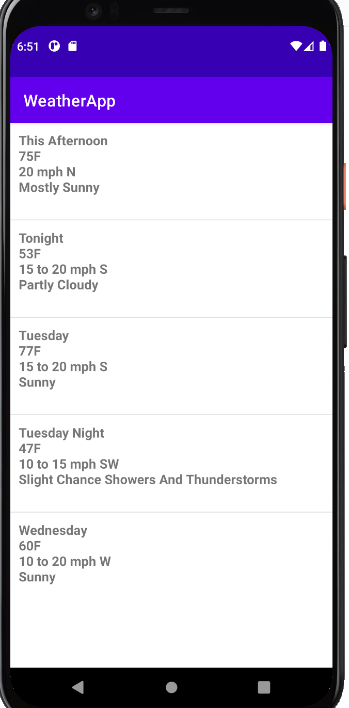

# Summary
This weather app is a few years old and needs to be refactored using the latest Android technologies
and architecture. 

## Logistics
Publish your work to your own personal repository (Github, Gitlab, etc)
  * Provide a link via email to the completed project.
  * Reach out via email if you have any questions. 

### Show your work
  * Showing commit history is encouraged.

### Timing
* We suggest spending 3-5 hours on the exercise. 
* Please submit your solution no later than 2 weeks after it has been recieved.
  * If an extension is needed, please let me know via email. 

## Tasks
* Refactor or rewrite the existing code using best practices.
  * We try to leverage Jetpack components where possible in Ballpark.
* The forecast for Wednesday night is not being shown. Add that forecast to the end of the view.

## Guidelines
* Pull in any external library if necessary.
* We strongly recommend that you use Kotlin.
* You have full creative control over the code, views, and structure. Do what makes sense for long
term maintainability and testability. 

## Expectations
* The UI should look the same OR better.
* All forecasts should be shown in the list. 

## Bonus Round
* Add unit tests

## Screenshot

